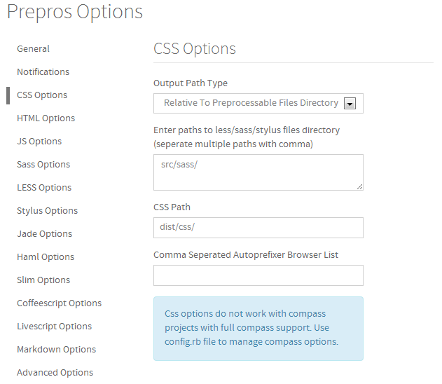
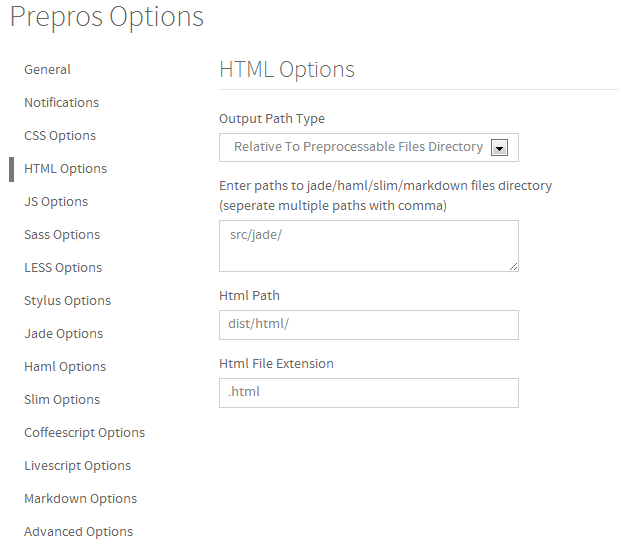

# Vasteam style guide -v0.1.0

包含三个部分

- 编码规则：[global样式维护指南](https://github.com/everyonme/vas-styleguide/blob/master/sass.md)
- 工程结构
- 环境配置
- 生产过程


##编码规则

编码:  `utf-8`

缩进:  `2空格`

首选HTML引擎 ： [jade](http://jade-lang.com)

首选CSS预处理器： [compass with prepros](http://alphapixels.com/prepros/)

> 之所以用 compass 是因为目前[stylus](http://learnboost.github.io/stylus/) 还没有对sprite支持比较好的插件；

> 后续可以考虑为 stylus 开发一个sprite插件；
  
    
##工程结构

注意： 都以文件类型命名文件夹
```
project/
  ├─src             #开发目录
  │  ├─ img
  │  ├─ sass
  │  └─ jade
  ├─dist             #发布目录
  │  ├─ img
  │  ├─ css
  │  ├─ font
  │  └─ html
  ├─test             #测试
  └─project.js       #配置
```


##环境配置

###安装
  
* [nodejs](http://nodejs.org/) 
* [prepros](http://alphapixels.com/prepros/)
* [vastl](https://github.com/everyonme/vastl) (vasteam 定制工具包）
  
    npm i -g vastl
  
###配置

prepros ：

css配置



html配置




##生产

使用 vastl 结合 prepros

vastl 文档 ：[https://github.com/everyonme/vastl](https://github.com/everyonme/vastl)


## todo

1. sass 语法指南
2. 工程初始化模板
3. 工程test方案
4. ftp功能整合
5. GUI
